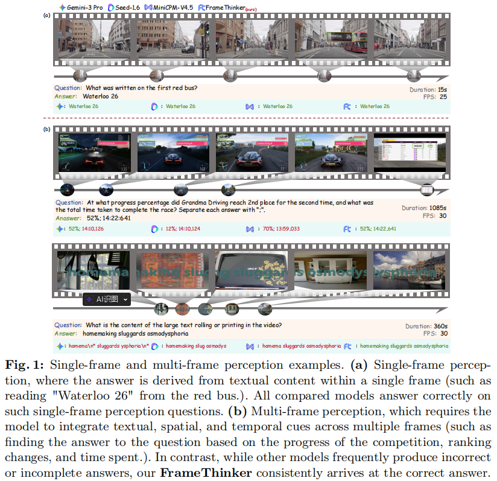
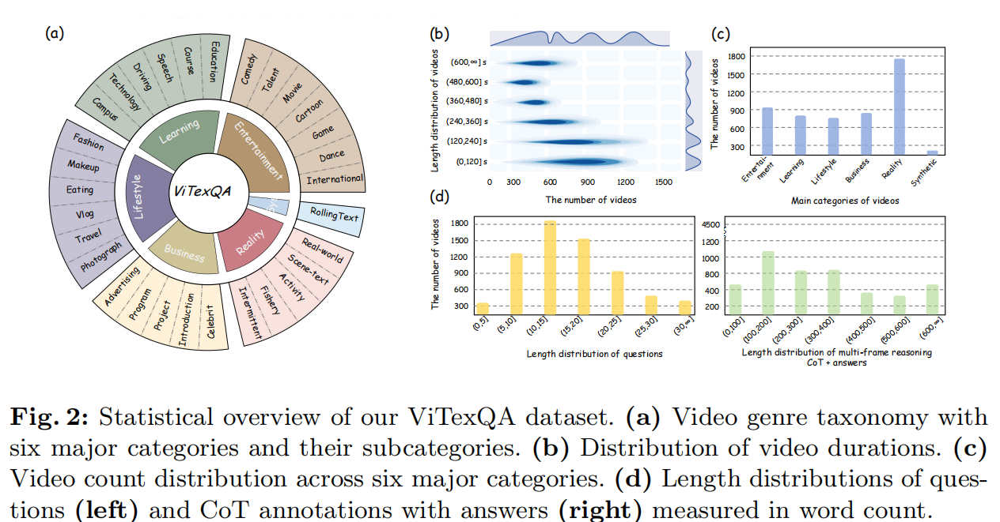
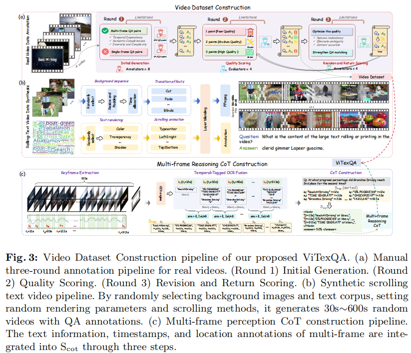
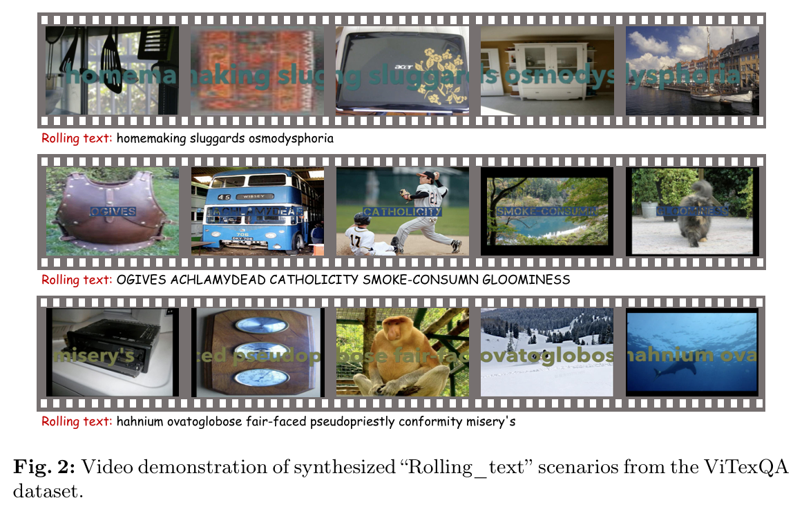

<div align="center">

# ViTexQA: A Multi-Frame Temporal Perception Dataset for Video Text Question Answering

[]()
[]()
[](https://www.modelscope.cn/datasets/faker12345/ViTexQA)

</div>

---

## 🔥 News

- **2026/06** 🎉 ViTexQA has been accepted to **ECCV 2026**.
- **2026/06** 🤗 ViTexQA dataset is released on Modelscope.
- **Coming Soon** Training code for FrameThinker.

---

## 📖 Introduction

ViTexQA is a large-scale benchmark for **multi-frame video text understanding**.

Unlike existing video text QA datasets, where many questions can still be answered from a single frame, **every question in ViTexQA requires integrating textual information across multiple video frames.**

<div align="center">



</div>

Our contributions include:

- ✅ 5,147 videos
- ✅ 6,864 QA pairs
- ✅ Multi-frame dependency
- ✅ Temporal Chain-of-Thought annotations
- ✅ Diverse real-world scenarios (sports, news, driving, tutorials, etc.)
- ✅ Synthetic rolling-text video generation pipeline

---

## 📊 Dataset Statistics

<div align="center">



</div>

ViTexQA contains

| Item | Value |
|------|------:|
| Videos | 5,147 |
| QA pairs | 6,864 |
| Categories | 30 |
| Duration | 363 Hours |

---

---

# 📝 Annotation Pipeline

To ensure that every question requires **genuine multi-frame temporal perception**, we develop a rigorous three-round human annotation pipeline.

<div align="center">



</div>

The annotation process consists of three stages:

### Round 1 · Initial Annotation

- Two annotators independently create question-answer pairs.
- Questions must require integrating textual information across multiple frames.
- Single-frame answerable questions are rejected.

### Round 2 · Quality Evaluation

Each sample is reviewed by senior evaluators according to:

- Multi-frame dependency
- Answer correctness
- Question clarity

Samples are assigned three quality levels:

- **Score 1:** Reject
- **Score 2:** Revision Required
- **Score 3:** Accepted

### Round 3 · Revision

Samples requiring revision are returned to expert annotators for refinement and re-evaluation until all annotations satisfy the highest quality standard.

This iterative annotation strategy guarantees:

- ✅ Multi-frame dependency
- ✅ High-quality QA pairs
- ✅ Accurate temporal reasoning annotations
- ✅ Diverse and unambiguous questions


# 📥 Dataset Download

The complete dataset is hosted on Modelscope.

> **Modelscope:**  
> https://www.modelscope.cn/datasets/faker12345/ViTexQA

Download includes:

```
ViTexQA/
│
├── train.json
├── test.json
│
└── videos/
  ├── Real_video/
  └── Synthetic_video/
```

Each sample contains

- index
- video_name
- question
- answer
- temporal CoT
- duration
- category

---

# 🛠 Synthetic Video Generation

We also release the synthetic rolling-text video generation pipeline used in the paper.

```
synthetic/
├── ILSVRC2012/
├── TextQA/
├── font/
├── textvqa.txt
├── words.txt
├── image2video_rolling.py
└── image2video_textqa.py
```

The pipeline supports

- Random text corpus
- Random fonts
- Random colors
- Shadows
- Transparency
- Scrolling animation
- Typewriter animation
- Multiple transition effects
- Automatic QA annotation generation

Example

```bash
python image2video_rolling.py 
python image2video_textqa.py
```

Generated videos can be directly used for training and evaluation.

---


# 📷 Examples

<div align="center">




</div>

---
<!-- 
# 📄 Paper

If you find our work useful, please consider citing

```bibtex
@inproceedings{vitexqa2026,
  title={ViTexQA: A Multi-Frame Temporal Perception Dataset for Video Text Question Answering},
  author={XXX},
  booktitle={ECCV},
  year={2026}
}
```

---

# 🙏 Acknowledgements

We thank all annotators and the open-source community for making this project possible.

---

# ⭐ Star

If ViTexQA is useful for your research, please consider giving this repository a ⭐. -->
